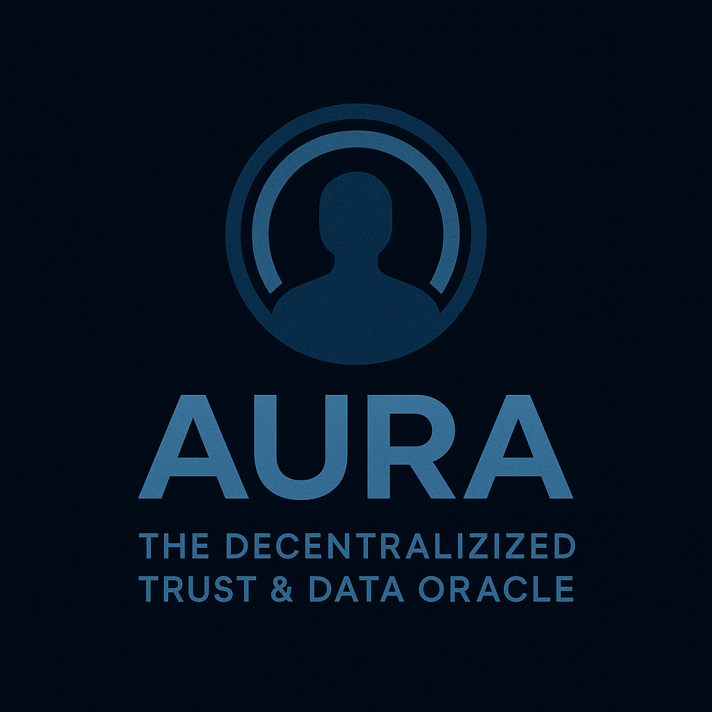

# Aura: Decentralized ID Wallet - Trust & Data Management

**Your Data, Your Rules, Verifiably.**



[](https://github.com/doublegate/Aura-DecentralTrust/releases/tag/v0.1.0)
[](https://github.com/doublegate/Aura-DecentralTrust/actions/workflows/ci.yml)
[](https://codecov.io/github/doublegate/Aura-DecentralTrust)
[](https://www.rust-lang.org)
[](https://opensource.org/licenses/MIT)

## 🎉 v0.1.0 Released with Security Hardening!

We're excited to announce the first official release of Aura DecentralTrust! 

### Download Pre-built Binaries
- [**Linux (x86_64)**](https://github.com/doublegate/Aura-DecentralTrust/releases/download/v0.1.0/aura-node-linux-amd64)
- [**macOS Intel**](https://github.com/doublegate/Aura-DecentralTrust/releases/download/v0.1.0/aura-node-darwin-amd64)
- [**macOS Apple Silicon**](https://github.com/doublegate/Aura-DecentralTrust/releases/download/v0.1.0/aura-node-darwin-arm64)
- [**Windows**](https://github.com/doublegate/Aura-DecentralTrust/releases/download/v0.1.0/aura-node-windows-amd64.exe)

### 🔒 Security Update
All 13 security vulnerabilities identified in our comprehensive security audit have been resolved, including:
- JWT authentication with environment-based secrets
- Rate limiting and DoS protection
- Mutual TLS support for node communication
- Transaction signature verification
- Audit logging for security events
- SSRF protection and input validation

## Overview

Aura is a decentralized identity and trust network that combines Decentralized Identifiers (DIDs), Verifiable Credentials (VCs), and Zero-Knowledge Proofs (ZKPs) to enable self-sovereign identity and user-controlled data management.

## Project Status

**Phase 1 Foundation Release (v0.1.0)** - June 1, 2025

### What's New in v0.1.0
- ✅ **Multi-platform Support**: Binaries for Linux, macOS (Intel/ARM), and Windows
- ✅ **Full CI/CD Pipeline**: Automated testing and releases
- ✅ **Security Hardened**: All critical vulnerabilities resolved
- ✅ **Production Ready Infrastructure**: 95% of Phase 1 complete

### Implemented Components
- ✅ **Aura Ledger** - Blockchain with Proof-of-Authority consensus
- ✅ **DID Registry** - W3C-compliant DID management
- ✅ **VC Schema Registry** - Credential schema management
- ✅ **Revocation Registry** - Credential revocation tracking
- ✅ **Aura Wallet Core** - Identity and credential management (Rust/WASM ready)
- ✅ **Aura Node** - Network participation software with REST API
- ✅ **Security Features** - JWT auth, TLS support, replay protection
- ✅ **Basic Examples** - Credential issuance and verification use cases

## Architecture

```
+-----------------------+      +-------------------------+      +-----------------------+
|     Issuers           |----->| Aura Identity Wallet    |<---->|    Relying Parties    |
| (e.g., Gov, Uni, Emp) |      | (User Agent)            |      | (e.g., Websites, Apps)|
+-----------------------+      | - DID Management        |      +-----------------------+
           |                   | - VC Storage (Encrypted)|               |
           | Issues VCs        | - Selective Disclosure  | Presents VPs  | Verifies VPs
           |                   | - ZKP Generation        |               |
           V                   +-------------------------+               |
+------------------------------------------------------------------------+
|                            Aura Network                                |
|                                                                        |
|  +---------------------+   +-------------------------------------+     |
|  | Aura Nodes          |<->| Aura Ledger (DLT)                   |     |
|  | - Validators        |   | - DID Registry                      |     |
|  | - Query Nodes       |   | - VC Schema Registry                |     |
|  | (- Storage Nodes)   |   | - Issuer Key Registry               |     |
|  +---------------------+   | - Revocation Registry               |     |
|                            +-------------------------------------+     |
|                                                                        |
|  User-Controlled Off-Chain Storage (Encrypted VCs & PII)               |
|  (Device, Personal Cloud, Decentralized Storage like IPFS)             |
+------------------------------------------------------------------------+
```

## Quick Start

### Using Pre-built Binaries (Recommended)

1. Download the appropriate binary for your platform from the [releases page](https://github.com/doublegate/Aura-DecentralTrust/releases/tag/v0.1.0)
2. Make it executable (Linux/macOS): `chmod +x aura-node`
3. Set up security configuration:
   ```bash
   # Set JWT secret (required for production)
   export AURA_JWT_SECRET=$(openssl rand -base64 32)
   
   # Create credentials file (optional - uses defaults if not provided)
   cp config/credentials.example.json config/credentials.json
   ```
4. Run the node:
   ```bash
   # Basic mode
   ./aura-node
   
   # With TLS enabled (recommended)
   ./aura-node --enable-tls
   ```

### Get Authentication Token

```bash
# Default credentials (change in production!)
curl -X POST http://localhost:8080/auth/login \
  -H "Content-Type: application/json" \
  -d '{"node_id": "validator-node-1", "password": "validator-password-1"}'
```

## Building from Source

### Prerequisites

- Rust 1.70+ (install from https://rustup.rs)
- C/C++ development tools (gcc, g++, clang)
- For GCC 15+ users: CXXFLAGS configuration may be needed (see build notes)

### Building

```bash
# Clone the repository
git clone https://github.com/doublegate/Aura-DecentralTrust
cd Aura-DecentralTrust

# Install system dependencies (Fedora/RHEL/Bazzite)
sudo dnf install -y clang clang-libs clang-devel

# Build all components
cargo build --release
```

### Special Build Notes

- **GCC 15+ Users**: If you encounter C++ compilation errors, add this to your shell config:
  ```bash
  export CXXFLAGS="-std=c++17 -include cstdint"
  ```
  Or create `~/.cargo/config.toml` with:
  ```toml
  [env]
  CXXFLAGS = "-std=c++17 -include cstdint"
  ```
- **Fedora/RHEL/Atomic-UnivBlue**:  Install clang packages (`sudo dnf install -y clang clang-libs clang-devel`)
- **Ubuntu/Debian**:                Install `clang` package (`sudo apt-get install -y clang`)
- **macOS**:                        Install Xcode Command Line Tools
- **Windows**:                      Use WSL2 or MSYS2 with mingw-w64

### Running a Node

```bash
# First time setup - copy example config
cp config/config.example.toml config/config.toml

# Run a query node (default)
cargo run --bin aura-node

# Run a validator node
cargo run --bin aura-node -- --node-type validator

# Specify custom data directory and API port
cargo run --bin aura-node -- --data-dir ./mydata --api-addr 127.0.0.1:8081

# Use a custom config file
cargo run --bin aura-node -- --config /path/to/custom/config.toml
```

### Running the Example

```bash
cargo run --example basic_usage
```

## Core Components

### aura-common
Shared types and utilities following W3C standards for DIDs and VCs.

### aura-crypto
Cryptographic primitives including:
- Ed25519 signatures
- AES-256-GCM encryption
- SHA-256 and Blake3 hashing

### aura-ledger
Blockchain implementation with:
- Proof-of-Authority consensus
- DID registry
- VC schema registry
- Revocation registry
- RocksDB storage (bundled with the build, no system install needed)

### aura-wallet-core
Identity wallet functionality:
- Key management
- DID operations
- Credential storage
- Presentation generation
- WASM compilation support

### aura-node
Network node implementation:
- P2P networking (libp2p)
- Block production (validators)
- REST API
- Transaction processing

## API Endpoints

The Aura node exposes the following REST API endpoints (all require JWT authentication except `/` and `/auth/login`):

- `GET /` - API information
- `POST /auth/login` - Authenticate and get JWT token
- `GET /node/info` - Node status and information
- `GET /did/{did}` - Resolve a DID
- `GET /schema/{id}` - Get a credential schema
- `POST /transaction` - Submit a transaction (with signature verification)
- `GET /revocation/{list_id}/{index}` - Check revocation status

### Security Features
- **Authentication**: Bearer token required for protected endpoints
- **Rate Limiting**: 60 requests/minute, 1000 requests/hour per IP
- **Request Size**: Maximum 10MB request body
- **HTTPS**: TLS support with `--enable-tls` flag
- **Audit Logging**: All security events are logged

## Development Roadmap

### Phase 1: Foundation & Core Infrastructure (95% Complete)
- ✅ Core ledger with PoA consensus
- ✅ W3C-compliant DID and VC functionality
- ✅ Identity wallet core (Rust/WASM ready)
- ✅ P2P network infrastructure
- ✅ REST API with JWT authentication
- ✅ Security hardening complete
- ⏳ API-blockchain integration (v0.2.0)
- ⏳ Desktop wallet MVP (v1.0.0)

### Phase 2: Ecosystem Growth & Advanced Features
- Transition to Proof-of-Stake consensus
- Zero-Knowledge Proof integration
- SDKs for JavaScript, Python, Go
- Mobile wallet applications
- IPFS integration for credential storage

### Phase 3: Mainstream Adoption & Governance
- Decentralized governance model
- Cross-chain interoperability
- Enterprise-grade features
- Regulatory compliance tools

## Contributing

Contributions are welcome! Please read our contributing guidelines before submitting PRs.

## License

This project is dual-licensed under MIT and Apache 2.0 licenses.

## Security

Aura implements comprehensive security measures including:
- JWT authentication with environment-based secrets
- Rate limiting and DoS protection
- Mutual TLS for node-to-node communication
- Transaction signature verification
- Comprehensive input validation and SSRF protection
- Audit logging for security events
- Certificate pinning for P2P connections

See [SECURITY_NOTICE.md](docs/SECURITY_NOTICE.md) for important security information and best practices.

For security concerns, please email security@aura-network.org

## Learn More

- [Project Outline](docs/proj_outline.md) - Detailed technical specification
- [Phase 1 Summary](docs/PHASE1_SUMMARY.md) - Implementation details and achievements
- [Phase 1 Completion Report](docs/PHASE1_COMPLETION_REPORT.md) - Functionality and readiness assessment
- [Security Audit](docs/SECURITY_AUDIT_PHASE1.md) - Comprehensive security analysis
- [Documentation Index](docs/README.md) - All project documentation
- [Documentation](https://docs.aura-network.org) - Coming soon
- [Community Forum](https://forum.aura-network.org) - Coming soon

## Project Metrics

- **Current Version**: v0.1.0
- **Language**: Rust (with WASM support)
- **Platforms**: Linux, macOS (Intel/ARM), Windows
- **Dependencies**: 100+ (managed via Cargo)
- **Code Quality**: Zero clippy warnings, security audit passing
- **CI/CD**: Fully automated with GitHub Actions


